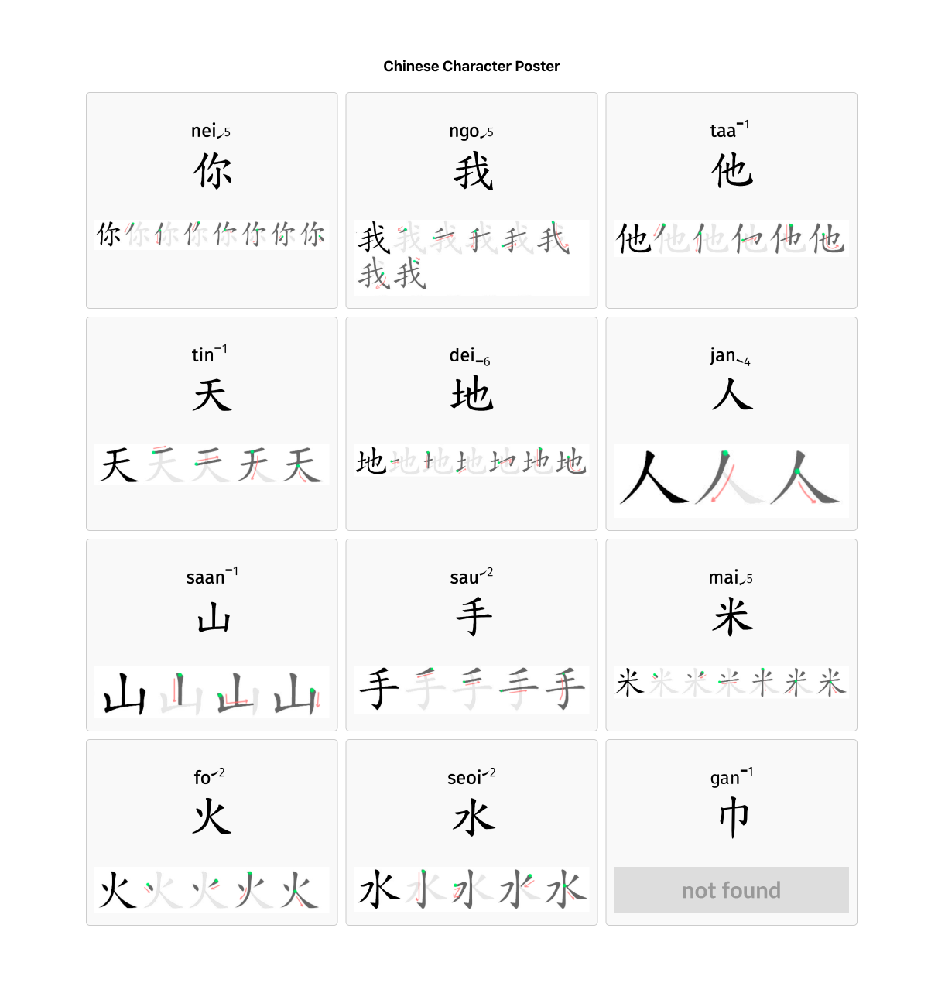

# Chinese Poster

Chinese Poster is simple Chinese learning poster generator with Jyutping and stroke guide from wikimedia.org.



## Installation Guide

Follow these steps to set up the project:

1. **Clone the repository**:
   ```bash
   git clone <repository-url>
   cd chinese-poster
   ```

2. **Install dependencies**:
   ```bash
   npm install
   ```

3. **Update the character list (data.csv) and run the preprocess script to fetch the stroke guide from wikimedia.org**:
   ```bash
   npm run preprocess
   ```

4. **Start the development server**:
   ```bash
   npm run dev
   ```

5. **Build for production**:
   ```bash
   npm run build
   ```

6. **Preview the production build**:
   ```bash
   npm run preview
   ```

## License

This project is licensed under the MIT License.
